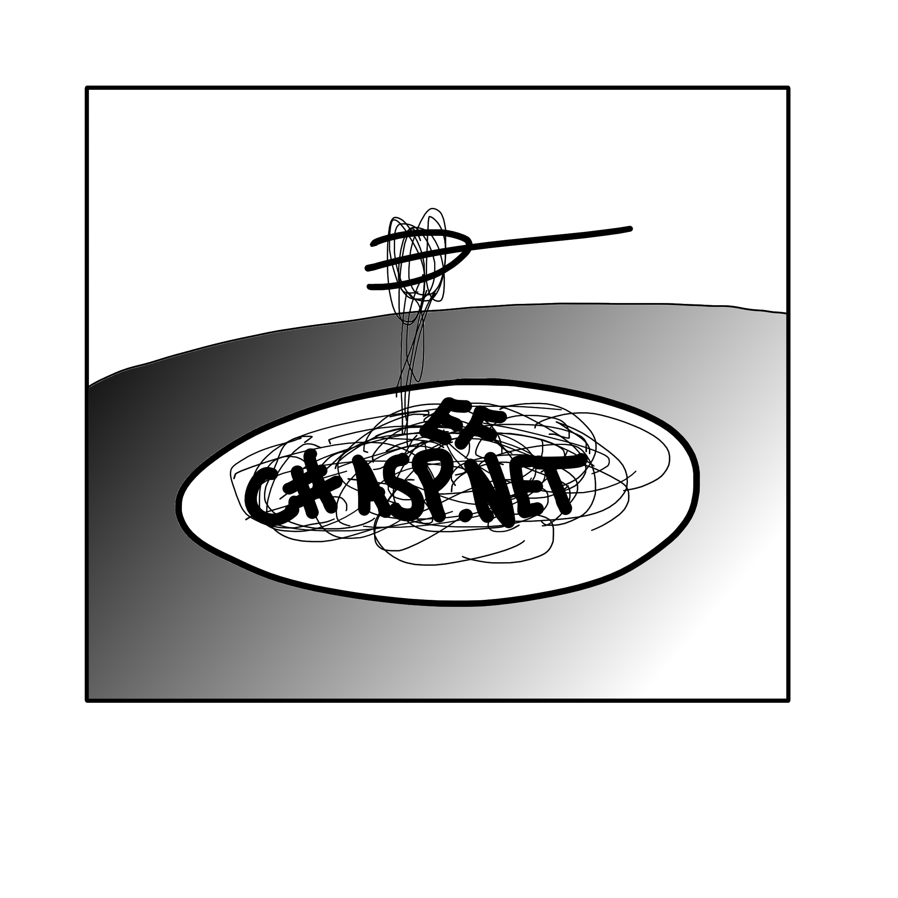

<h1 align="center">Caspnetti</h1>



<blockquote align="center">"Mom's caspnetti"</blockquote>

### An opinionated and cooked c# asp.net core web application boilerplate featuring:

- 🐋 Fully [dockerized](https://www.docker.com/) environment
- 📝 Code-first SQL and [migrations](https://learn.microsoft.com/en-us/ef/core/managing-schemas/migrations/managing?tabs=dotnet-core-cli) using [entity framework](https://learn.microsoft.com/en-us/ef/core/cli/dotnet)
- ⚖️ A controller, entity, service, and test abstraction pattern built for any scale
- 🔍 [Adminer](https://www.adminer.org/en/) for easy database viewing

## Quickstart:

Download docker.

```
./scripts/
docker compose up -d
```

> It's that simple

## Frequently used commands:

Surgically destroy and rebuild images:

```
docker compose down --rmi local
```

Enter backend container:

```
docker exec -it caspnetti_backend bash
```

Build solution:

```
dotnet build
```

Start API

```
dotnet run --project Caspnetti.API
```

Create migrations

## View API:

Navigate to https://localhost

## View database:

Navigate to http://localhost:8080
